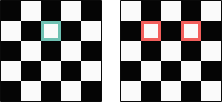
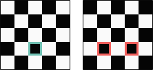
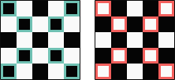
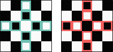
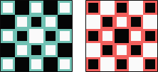
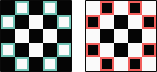

## Minor types / Малые типы

Self-explanatory structures and classes.
Структуры и классы, не требующие пояснений.

### PieceLocation / Локация фигуры

```F#
[<Struct>]
type public PieceLocation = { //Локация фигуры
    File: uint32              // Файл
    Rank: uint32              // Ранк
}
```

### PieceRelocation / Смещение фигуры

```F#
[<Struct>]
type public PieceRelocation = { // Смещение фигуры
    FileDelta: uint32           // Дельта файла
    RankDelta: uint32           // Дельта ранка
}
```

### Team / Команда

```F#
[<Struct>]
type public Team = // Команда
    | Undefined    // Не определена
    | White        // Чёрных
    | Grays        // Всех серых
    | Black        // Белых
```

### Feud / Вражда

```F#
[<Struct>]
type public Feud =            // Вражда
    | WithSameTeam            // С той же командой
    | WithNeutrals            // С нейтральными командами
    | WithOpposite            // С командой соперника
    | WithSameTeamAndNeutrals // С той же командой и с нейтральными командами
    | WithNeutralsAndOpposite // С нейтральными командами и с командой соперника
    | WithSameTeamAndOpposite // С той же командой и с командой соперника
    | WithEveryone            // С каждой командой
```

### PieceDislodgement / Вытеснение фигуры

```F#
[<Struct>]
type public PieceDislodgement = { // Вытеснение фигуры
    Relocation: PieceRelocation   // Смещение фигуры
    Feud:       Feud              // Вражда
}
```

### PieceDevelopment / Создание и улучшение фигуры

```F#
[<Struct>]
type public PieceDevelopment = {     // Создание и улучшение фигуры
    Advances: Set<PieceRelocation>   // Продвижения
    Captures: Set<PieceDislodgement> // Взятия
}
```

### Piece / Фигура

```C#
// Фигура ( Создание и улучшение фигуры , Команда )
public sealed class Piece(PieceDevelopment development, Team team)
{
    public readonly Guid Guid = Guid.NewGuid(); // Гуид
    public readonly Team Team = team;           // Команда

    private readonly HashSet<PieceRelocation>   Advances
        = development.Advances.ToHashSet();     // Продвижения
    private readonly HashSet<PieceDislodgement> Captures
        = development.Captures.ToHashSet();     // Взятия

    public bool ContainsAdvance(PieceRelocation relocation)
        => Advances.Contains(relocation);       // Есть ли продвижение?
    public bool ContainsCapture(PieceDislodgement dislodgement)
        => Captures.Contains(dislodgement);     // Есть ли взятие?
}
```

## Major types / Большие типы

Modules and classes requiring explanation.
Модули и классы, требующие пояснения.

### module public StandardPieces / Публичный модуль стандартные фигуры

Contains `PieceDevelopment`s for creating standard `Piece`s. / Содержит `PieceDevelopment`'ы для создания стандартных `Piece`.

🟦 blue indicates which `PieceRelocation`s are included in `Piece.Advances`. / Синий показывает, какие `PieceRelocation`'ы включены в `Piece.Advances`.

🟥 Red indicates which `PieceDislodgement`s are included in `Piece.Captures`. / Красный показывает, какие `PieceDislodgement`'ы включены в `Piece.Captures`.

#### .whitePawn / Белая пешка



#### .blackPawn / Чёрная пешка



#### .anyBishop / Любой слон



#### .anyRook / Любая ладья



#### .anyKing / Любой король


#### .anyQueen / Любой ферзь



#### .anyKnight / Любой конь



### public sealed class Board / Публичный запечатанный класс доска

❔ indicates method-predicate. / Oбозначает метод-предикат.

❕ indicates method-mutator. / Oбозначает метод-мутатор.

❗ indicates method-accessor. / Oбозначает метод-аксессор.

#### ❔ .CanAddPiece(Piece piece) / Можно ли добавить фигуру?

Checks whether the `piece` can be added to **`this`** `Board`.
Проверяет, можно ли добавить `piece` на **`this`** `Board`.

Returns **`true`** if the `piece`'s `Piece.Guid` has not been added yet; otherwise, **`false`**.
Возвращает **`true`**, если `Piece.Guid` параметра `piece` еще не был добавлен; в противном случае — **`false`**.

#### ❔ .CanAddPiece(PieceLocation location) / Можно ли добавить фигуру?

Checks whether a `Piece` can be added to the `location` on **`this`** `Board`.
Проверяет, можно ли добавить `Piece` на **`this`** `Board` в указанную `location`.

Returns **`true`** if the `location` on **`this`** `Board` has not been occupied; otherwise, **`false`**.
Возвращает **`true`**, если `location` на **`this`** `Board` не оккупирована; в противном случае — **`false`**.

#### ❕ .AddPiece(Piece piece, PieceLocation location) / Добавить фигуру!

Adds the `piece` to the `location` on **`this`** `Board`.
Добавляет `piece` на **`this`** `Board`, в указанную `location`.

#### ❔ .CanDeletePiece(PieceLocation location) / Можно ли снять фигуру?

Checks whether a `Piece` can be removed from the `location` on **`this`** `Board`.
Проверяет, можно ли убрать `Piece` с`location` на **`this`** `Board`.

Returns **`true`** if the `location` on **`this`** `Board` has been occupied by a `Piece`; otherwise, **`false`**.
Возвращает **`true`**, если `location` на **`this`** `Board` занята`Piece`; в противном случае — **`false`**.

#### ❕ .DeletePiece(PieceLocation location) / Снять фигуру!

Removes a `Piece` from the `location` on **`this`** `Board`.
Удаляет `Piece` из `location` на **`this`** `Board`.

#### ❔ .CanReadPiece(PieceLocation location) / Можно ли прочитать фигуру?

Checks whether a `Piece` can be read from the `location` on **`this`** `Board`.
Проверяет, можно ли прочитать `Piece` из `location` на **`this`** `Board`.

Returns **`true`** if the `location` on **`this`** `Board` has been occupied by a `Piece`; otherwise, **`false`**.
Возвращает **`true`**, если `location` на **`this`** `Board` занята`Piece`; в противном случае — **`false`**.

#### ❗ .ReadPiece(PieceLocation location) / Прочитать фигуру!

Reads a `Piece` from the `location` on **`this`** `Board`.
Считывает `Piece` из `location` на **`this`** `Board`.

Returns a `Piece` that occupies the `location` on **`this`** `Board`.
Возвращает `Piece`, занимающую `location` на **`this`** `Board`.

#### ❔ .CanMoveFrom(PieceLocation location) / Можно ли сдвинуться?

Checks whether a `Piece` can be moved from the `location` on **`this`** `Board`.
Проверяет, можно ли переместить `Piece` с указанной `location` на **`this`** `Board`.

Returns **`true`** if the `location` on **`this`** `Board` has been occupied by a `Piece`; otherwise, **`false`**.
Возвращает **`true`**, если `location` на **`this`** `Board` занята`Piece`; в противном случае — **`false`**.

#### ❔ .CanMoveThrough(PieceLocation location, PieceRelocation relocation) / Можно ли пройти?

Checks whether a `Piece` on **`this`** `Board` can move from `location` by `relocation`.
Проверяет, может ли `Piece` на **`this`** `Board` переместиться из позиции `location` согласно `relocation`.

Returns **`true`** if the `relocation` is horse-like or no occupation in the way; otherwise, **`false`**.
Возвращает **`true`**, если `relocation` напоминает ход коня или на пути нет занятых клеток; в противном случае — **`false`**.

There is an overload for `PieceDislodgement`.
Существует перегрузка для `PieceDislodgement`.

```C#
public bool CanMoveThrough(PieceLocation location, PieceDislodgement dislodgement)
{
    return CanMoveThrough(location, dislodgement.Relocation);
}
```

#### ❔ .CanAdvanceTo(PieceLocation location) / Можно ли продвинуться?

Checks whether a `Piece` on **`this`** `Board` can advance to the `location`.
Проверяет, может ли `Piece` на **`this`** `Board` доске переместиться в указанную позицию.

Returns **`true`** if the `location` on **`this`** `Board` has not been occupied; otherwise, **`false`**.
Возвращает **`true`**, если `location` на **`this`** `Board` не занята; в противном случае — **`false`**.

#### ❔ .CanCaptureOn(PieceLocation location) / Можно ли захватить?

Checks whether a `Piece` on **`this`** `Board` can capture on the `location`.
Проверяет, может ли `Piece` на **`this`** `Board` взять `Piece` в указанной позиции.

Returns **`true`** if the `location` on **`this`** `Board` has been occupied by a `Piece`; otherwise, **`false`**.
Возвращает **`true`**, если `location` на **`this`** `Board` занимает `Piece`; в противном случае — **`false`**.

#### ❕ .Advance(PieceLocation oldLocation, PieceRelocation relocation) / Продвинуть!

Advances a `Piece` on **`this`** `Board` from the `oldLocation` by the `relocation`.
Перемещает `Piece` на **`this`** `Board` из `oldLocation` с помощью `relocation`.

#### ❕ .Capture(PieceLocation oldLocation, PieceDislodgement dislodgement) / Захватить!

Captures a `Piece` on **`this`** `Board` from the `oldLocation` by the `dislodgement`.
Захватывает `Piece` на **`this`** `Board` из `oldLocation` с помощью `dislodgement`.
